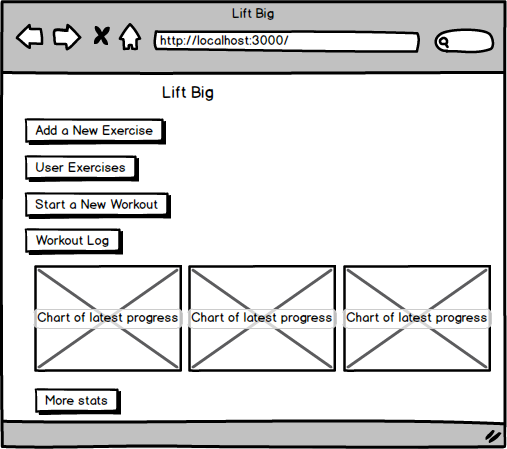
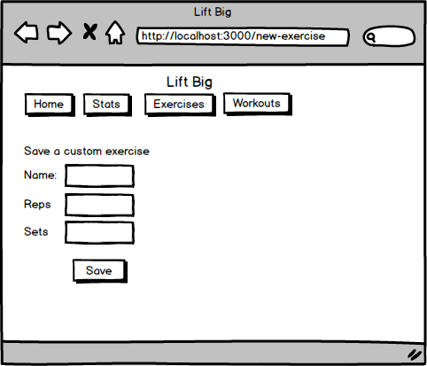
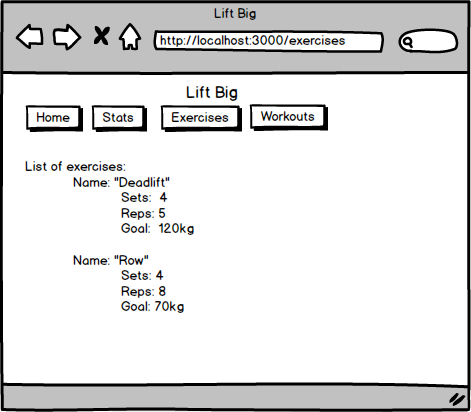
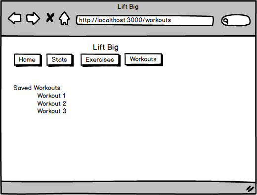
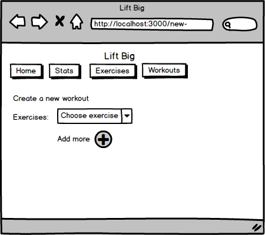
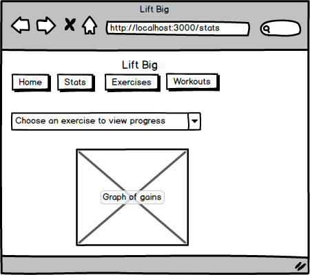

The content below is an example project proposal / requirements document. Replace the text below the lines marked "__TODO__" with details specific to your project. Remove the "TODO" lines.

# Lift Big

## Overview

Need a spot, bro?

Get on track to hit those personal bests with Lift Big, your best gym buddy. A completely customisable workout tracking tool to assist you in reaching your weightlifting goals.
When logged in, users can input and save custom exercises, input number of sets and number of reps completed and save these to a workout, which is available to for the user to review.
Get your motivation going by setting personal goals for each exercise you input and watch your progress on charts generated from previous workouts. 
 

## Data Model


Application stores Users, Exercises and Workouts
* users can save multiple exercises, each exercise has required properties to fill
* users can save multipled workouts, which consist of a collection of exercises

An Example User:

```javascript
{
  username: "zyzz",
  password: // password hash
  savedWorkouts: // object of previous workouts
  exercises: // array of custom exercises created by user
}
```

An Example Workout using Embedded Exercises
```javascript
{
  user: // a reference to a User object
  name: "back day"
  exercises: [
    { name: "deadlift", sets: "4", reps: "5", weight: "100"},
    { name: "standing back row", sets: "4", reps: "8", weight: "50"},
  ],
  completed: //date of workout
}
```

Example of Exercises created by User
```javascript
{
  deadlift: {
    name: "deadlift"
    sets: 4
    reps: 5
    goal: 120
  }, 

}
```

## [Link to Commented First Draft Schema](db.js) 

[db.js](db.js)

## Wireframes

/ - home page



/add



/exercises



/workout-log



/new-workout



/stats




## Site map

Home
  -> New Exercise
  -> Exercises
  -> New Workout
  -> Workout Log
  -> Stats


## User Stories or Use Cases

1. as non-registered user, I can register a new account with the site
2. as a user, I can log in to the site
3. as a user, I can save a new exercise
4. as a user, I can view all exercises I've created
5. as a user, I can build a new workout
6. as a user, I can view all my saved workouts
7. as a user, I can view charts of progress across saved workouts


## Research Topics

* (4 points) Create charts of user progress
    * Chartist.js library
    * Imeplement some appealing CSS to spruce up graphs
* (5 points) Integrate user authentication
    * Passport for user authentication


## [Link to Initial Main Project File](app.js) 

[app.js](app.js)

## Annotations / References Used

1. [Chartist Docs] (http://gionkunz.github.io/chartist-js/)
2. [Express Generator] (https://expressjs.com/en/starter/generator.html)
